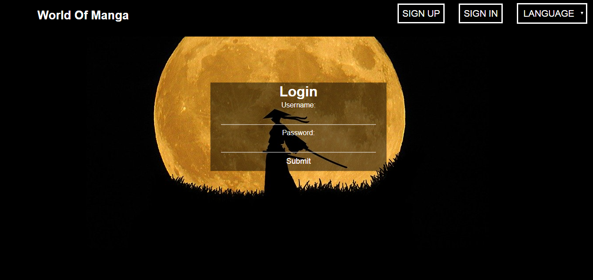

# WorldOfManga

## Table of Contents
* [General info](#general-info)
* [Demo](#demo)
* [Built With](#built-with)
* [Features](#features)
* [To Do](#to-do)
* [Status](#status)
* [Screenshots](#screenshots)

## General info
An application for manga fans to help manage their list of read titles.

## Demo
The application demo is available on the Heroku platform: https://world-of-manga.herokuapp.com/
It may take a while for the application to start. If the page loads without a manga list, please refresh the page after a while.

To log in as a user please provide:
- Username: user
- Password: user

To log in as a admin please provide:
- Username: admin
- Password: admin

## Built With 
- Java 11
- Spring (Boot, MVC, Security, Data JPA) - 2.2.3
- Thymeleaf
- Lombok - 1.18.10
- jUnit5 - 5.5.2
- Mockito - 3.1.0
- Selenium - 3.141.59
- Model Mapper - 2.3.0
- Maven
- MySQL
- PostgreSQL
- H2
- CircleCI

## Features
Available for all users:
- Select language (available options are: English and Polish)
- Recomendations
- View all added manga with genres

Available for unlogged users:
- Login
- Register

Available to users with "User" or "Admin" role:
- Rate manga
- Add manga to favorites
- Add manga to list based on status
- Browse manga by status
 
Available to users with only "Admin" role:
- Add new author
- Add, edit and delete manga

## To Do
- Editing and deleting authors

## Status
Project is: in progess

## Screenshots

Main Page

Login Page

Registration Page
